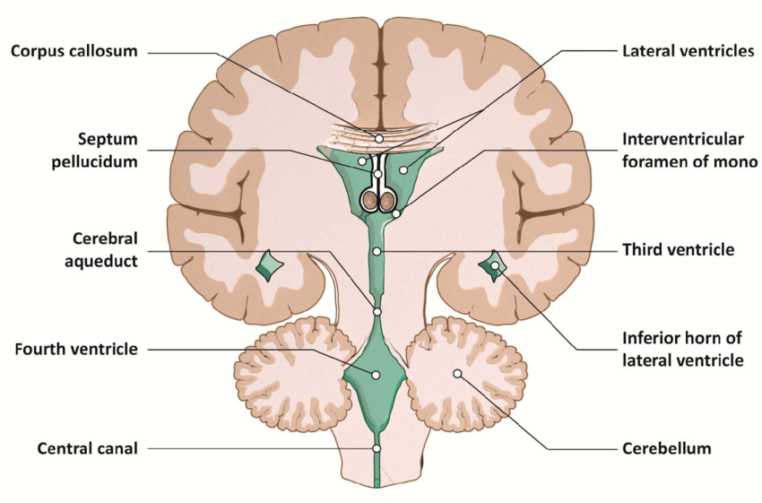
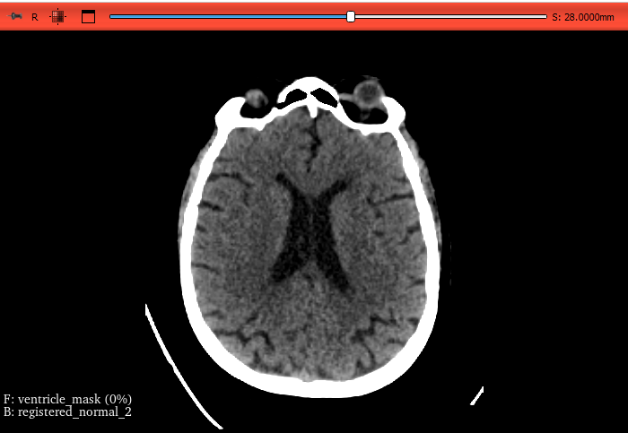
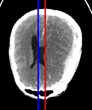
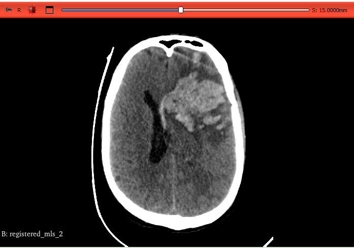

# Midline Shift Detection and Measurement in Brain CT Scans

Midline Shift is a condition which is always secondary to some other pathology which causes **Intracranial Pressure** inside the skull and displaces normal brain structures. These pathologies usually are `Haemorrhage`, `Tumor`, `Edema`. These take up space inside the skull and hence displace midline structures which include the falx ceribri, septum pellucidum, third ventricle, fourth ventricle, pineal gland and foreman of monro. This is called the midline shift.

Due to very less data model training for the same was not possible. This approach tries to solve the problem algorithmically using computer vision techniques. We use Nifti volumes of CT and if data is in Dicom there is a script in notebooks folder that will convert your DICOM files to a Nifti volume

These are the steps I followed:

- **Registration:** The nifti volume is registered in ANTS using an MRI atlas which is given in the repo. It performs linear transformation to rotate the volume so as to eliminate tilts in the scan. This atlas has slice thickness of 1mm which matched the data I had. I would recommend to download and use other atlas if your data has different slice thickness.

 - **Segmentation of Ventricles:** Ventricles are segmented using thresholding. Since ventricles are filled with CSF and it's HU range is between -5 and 20 so we use it to create a segmentation mask. I tried using segmentation models for this but they do not segment brain regions properly for brain samples which are not normal.

 - **Selection of ideal slice:** We select one ideal slice to perform our calculation on which is the one with maximum segmented area visible in the ventricle mask

 - **Ideal midline:** We find ideal midline by creating a bone mask and then computing a centre of mass through symmetry. Line through this is used as the first estimate for ideal midline. We then apply edge detection by defining regions of interest near the upper and bottom regions of the previous midline using canny function from cv2 and then make a line using hough transform.

 - **Actual midline:** This is calculated using PCA. The idea is that for a CT scan the ventricle mask contains ventricle regions and actual midline is estimated through them which would lie on the principal component because midline is also the line which gives us maximum spread in ventricles.

- **Measurement:** Distance between the x coordinates found above gives the distance of midline which is then converted from pixels to mm which is how it is usually reported

Following are the images of one slice as viewed on a 3D slicer

<table>
  <tr>
    <td align="center">
       
      Axial Slice
    </td>
    <td align="center">
       
      Slice form mask
    </td>
    <td align="center">
       
      Original slice with mask overlay
    </td>
  </tr>
</table>

This is a CT slice from a patient with a midline shift:

  

Ideal and actual midlines

### Limitations:
For some patients with midline shifts the scans show distortion in the shape of the ventricles. In that case the actual midline calculated would be erroneous since PCA would give the centre of mass of the data points which in this case would not be our coordinate. An example of that is the slice below which shows bleed that distorts the lateral ventricles. This problem can be solved through deep learning but in this case, we did not have enough data to train the model.

  

Distorted Ventricles

